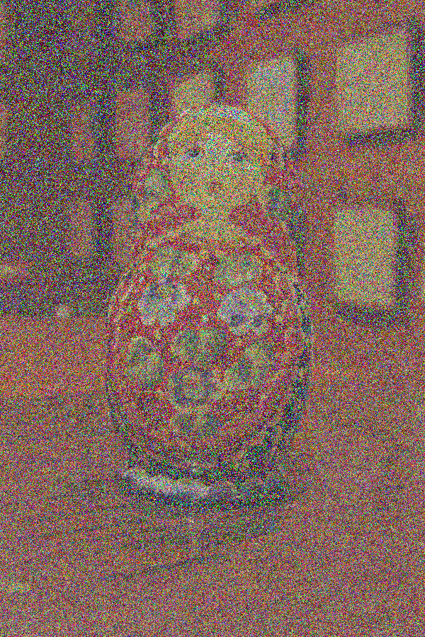
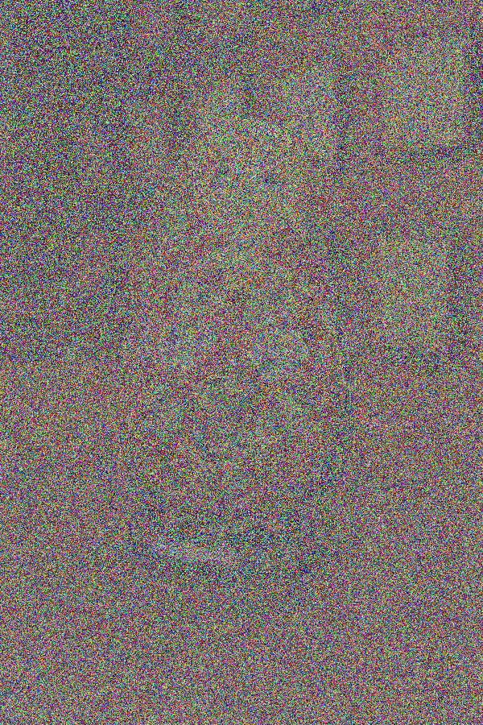
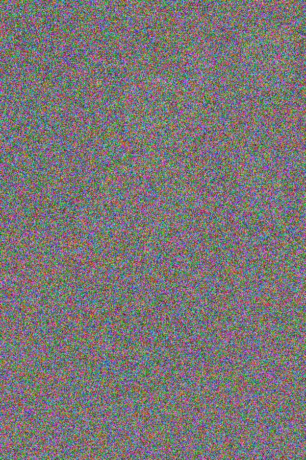

\mainpage
# BMP Image Steganography

Library for hiding information into BMP images. This is the fourth assignment of EPL232.


## Usage
A client of this library can look like this
```C
#include "bmplib.h"
//Prints meta info of an image (file header and info header)
getMetaInfo("image.bmp");

//Applies a grayscale filter to "image.bmp" and saves it as "gray-image.bmp"
applyGrayscale("image.bmp");

//Hides "hidden.bmp" into "shell.bmp".
//Uses "shell.bmp"'s 4 least significant bits to hide "hidden.bmp"'s 4 most significant bits
// New image is saved as "new-shell.bmp".
encodeImageWithinImage("shell.bmp","hidden.bmp",4);

//Reverses encodeImage and saves the revealed image as "new-new-shell.bmp"
decodeHiddenImageFromEncodedImage("new-shell.bmp",4);

//Hides contents of "someStrings.txt" into "image.bmp"
//New image is saved as "new-image.bmp"
encodeTextInsideAnImage("image.bmp", "someStrings.txt");

//Extract the text and saves it as "text.txt"
decodeTextFromImage("new-image.bmp", 280, "text.txt");

//Saves contents of "text.txt" as a seemingly nonsense image "new-frame.bmp". Has the same dimensions as "frame.bmp".
saveTextAsImage("text.txt", "frame.bmp");

//Reverses saveTextAsImage. Saves text as "output.txt". 
textFromImage("new-frame.bmp");

//Hides "hidden.bmp" in an encrypted form inside "shell.bmp".
//New image is saved as "encrypted-shell.bmp"
encryptAndHideImage("shell.bmp", "hidden.bmp", "swiftrules");

//Extracts and decrypts the hidden image and saves it as "decrypted-encrypted-shell.bmp".
decryptHiddenImage("encrypted-shell.bmp", "swiftrules");
```

## Bonus functions

### Encrypt Image within Image
####Usage
```bash
./bmpSteganography -encryptStegano SHELL_IMAGE.bmp TO_HIDE.bmp PASSWORD
```
New image is saved as *encrypted-* SHELL_IMAGE.bmp

Suppose two images **img1** and **img2**. 

Suppose the first data bytes **byte1** and **byte2** of img1 and img2 respectively:

**byte1**:&nbsp;&nbsp;&nbsp;&nbsp;**b1<sub>7</sub>b1<sub>6</sub>b1<sub>5</sub>b1<sub>4</sub>**&nbsp;&nbsp;&nbsp;b1<sub>3</sub>b1<sub>2</sub>b1<sub>1</sub>b1<sub>0</sub>

**byte2**:&nbsp;&nbsp;&nbsp;&nbsp;b2<sub>7</sub>b2<sub>6</sub>b2<sub>5</sub>b2<sub>4</sub>&nbsp;&nbsp;&nbsp;**b2<sub>3</sub>b2<sub>2</sub>b2<sub>1</sub>b2<sub>0</sub>**

Suppose that we merge them using 4 bits, as with the imageStegano function:

mergedByte:&nbsp;&nbsp;&nbsp;&nbsp;**b1<sub>7</sub>b1<sub>6</sub>b1<sub>5</sub>b1<sub>4</sub>**&nbsp;&nbsp;&nbsp;**b2<sub>3</sub>b2<sub>2</sub>b2<sub>1</sub>b2<sub>0</sub>**

But anyone could uncover the hidden image simply by making the LSB significant again!

This function attempts to encrypt the bits of the hidden image.

Given a password string, calculates a semi-unique hash and uses that as a seed for the randomizer.

Using the randomizer, it generates some modifications for each bit.

An example modification could be the following:

1. Swap bits 2 and 1
2. Flip the 3 first bits

So the bits **b2<sub>3</sub>b2<sub>2</sub>b2<sub>1</sub>b2<sub>0</sub>** become **b2<sub>3</sub>~b2<sub>1</sub>~b2<sub>2</sub>~b2<sub>0</sub>**
#### Example
Is one modification for each byte enough to encrypt an image?

Suppose we encrypt and hide the right image inside the left:


Suppose some one extracted the image without modifying anything(bit reordering/flipping).
Depending on if the encryptions were made once, twice, or thrice, they would get the following results respectively:




As you can see, modifying each byte 3 times yields the most desirable result.

To ensure the encryption strength, a default of 3 modifications will happen for each byte.
### Decrypt Image from Image
####Usage
```bash
./bmpSteganography -decryptStegano encrypted-SHELL_IMAGE.bmp PASSWORD
```
Extracted/decrypted image is saved as *decrypted-* encrypted-SHELL_IMAGE.bmp
Given a password, it applies the same modifications in reverse order.
### Space complexity
Because every modification is done independently for every byte, the function reads each byte, processes it and saves it.

The whole image is never stored which could be very useful for big images.


## License
[GPL](https://www.gnu.org/licenses/)